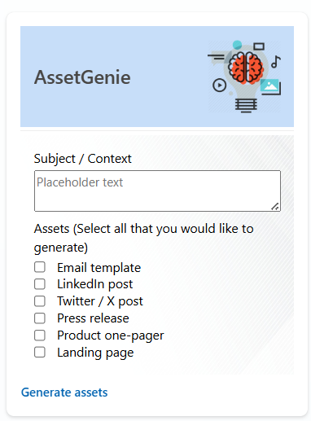
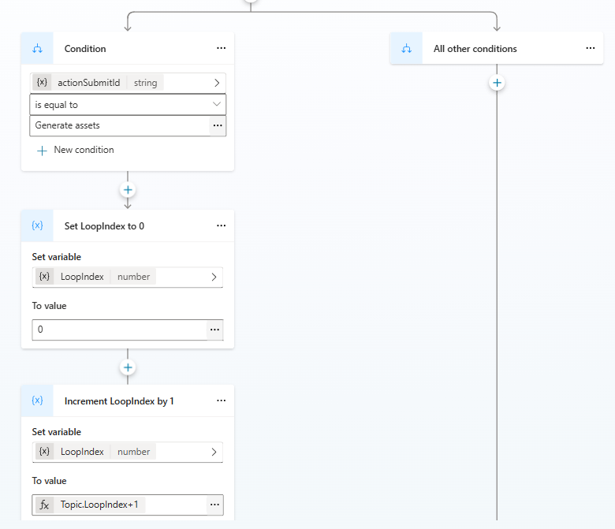
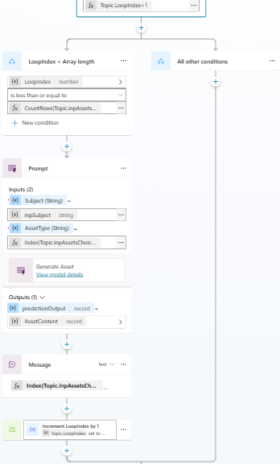
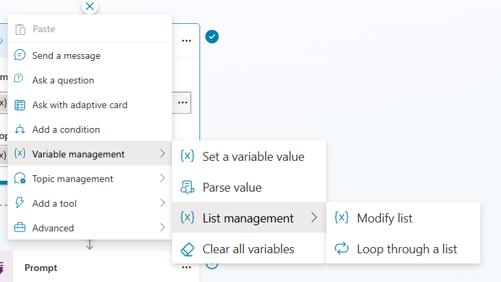
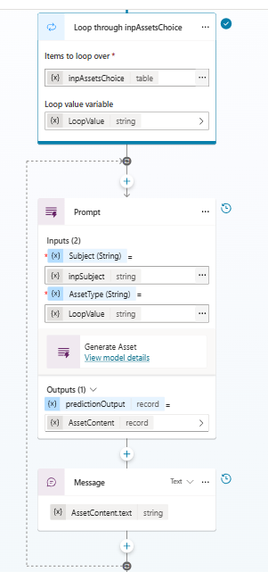

## Challenge
Working with collections of data is fundamental to application development, and arrays represent one of the most essential data structures for t2his purpose. A frequent requirement involves iterating through these collections to execute specific logic on individual items. While Copilot Studio serves as Microsoft's low-code platform for creating intelligent conversational agents, it currently lacks native looping functionality. Although a preview feature called "Loop through a list" has been introduced to handle list iteration, this capability remains in preview and hasn't reached general availability yet. In the meantime, developers need alternative approaches to manage and process collections effectively. This comprehensive guide provides a practical solution for this limitation while also exploring the upcoming "Loop through a list" preview feature.

 ## A Practical Example
 AssetGenie helps marketing teams quickly generate multiple content pieces for their campaigns. Users simply enter their campaign topic (like "AI-powered CRM software launch") and select which marketing assets they need from a checklist - email templates, LinkedIn posts, press releases, product one-pagers, etc. The bot then processes each selected item individually, generating customized content for every chosen asset type. This scenario perfectly demonstrates the need for looping in Copilot Studio, as we need to iterate through the user's multiple selections and generate content for each one.
 
 

### Setup
- An adaptive card with text input for users to enter subject or context of the campaign
- A choice set with all the asset types available for user to generate and a button to submit
- This adaptive card is placed in the "Ask with Adaptive card" node and the inputs are stored in two variables namely: "inpSubject"[string] and "inpAssetsChoice" [Table]

## Looping through inpAssetsChoice
- Now let's loop through inpAssetsChoice and pass the subject and current asset type (eg: Email template or Press release) to an AI builder prompt and generate content for that marketing asset

    

- Condition: If actionSubmitId is equal to "Generate assets"
- Set LoopIndex to 0: Create Set a variable value node from variable management and create new variable with name "LoopIndex", set its value as 0
- "Incement LoopIndex by 1": Next, create another Set a variable value node and use the same "LoopIndex" variable and in the vvalue field switch to Formula and enter the following Power Fx formula

    ```
    Topic.LoopIndex+1 
    ```
    

- Condition: LoopIndex "is less than or equal to" _fx_: CountRows(Topic.inpAssetsChoice)
    ```
    CountRows(Topic.inpAssetsChoice)
    ```
- Prompt: Provide inputs: inpSubject and current item: _fx:_ Index(Topic.inpAssetsChoice, Topic.LoopIndex).Value
    ```
    Index(Topic.inpAssetsChoice, Topic.LoopIndex).Value
    ```
- Message: Select the AI Builder output: Topic.AssetContent.text
    ```
    Topic.AssetContent.text
    ```
- Go To step: Insert Go To step from Topic management and select the node "Incement LoopIndex by 1""

### Complete YAML topic 
```
kind: AdaptiveDialog
beginDialog:
  kind: OnConversationStart
  id: main
  actions:
    - kind: AdaptiveCardPrompt
      id: zlhU2Y
      card: |-
        {
          "type": "AdaptiveCard",
          "$schema": "https://adaptivecards.io/schemas/adaptive-card.json",
          "version": "1.5",
          "body": [
            {
              "type": "Container",
              "showBorder": true,
              "roundedCorners": true,
              "style": "accent",
              "items": [
                {
                  "type": "ColumnSet",
                  "columns": [
                    {
                      "type": "Column",
                      "width": "stretch",
                      "items": [
                        {
                          "type": "TextBlock",
                          "text": "AssetGenie",
                          "wrap": true,
                          "size": "Large",
                          "color": "Default",
                          "isSubtle": true,
                          "style": "heading",
                          "horizontalAlignment": "Left"
                        }
                      ],
                      "backgroundImage": {
                        "verticalAlignment": "Center"
                      },
                      "horizontalAlignment": "Left",
                      "verticalContentAlignment": "Center"
                    },
                    {
                      "type": "Column",
                      "width": "stretch",
                      "backgroundImage": {
                        "verticalAlignment": "Center"
                      },
                      "items": [
                        {
                          "type": "Image",
                          "url": "https://icon-library.com/images/content-icon/content-icon-16.jpg",
                          "size": "Medium",
                          "horizontalAlignment": "Right"
                        }
                      ]
                    }
                  ]
                }
              ]
            },
            {
              "type": "Container",
              "showBorder": true,
              "roundedCorners": true,
              "separator": true,
              "items": [
                {
                  "type": "Input.Text",
                  "label": "Subject / Context",
                  "placeholder": "Placeholder text",
                  "isMultiline": true,
                  "id": "inpSubject"
                },
                {
                  "type": "Input.ChoiceSet",
                  "label": "Assets (Select all that you would like to generate)",
                  "choices": [
                    {
                      "title": "Email template",
                      "value": "Email template"
                    },
                    {
                      "title": "LinkedIn post",
                      "value": "LinkedIn post"
                    },
                    {
                      "title": "Twitter / X post",
                      "value": "Twitter / X post"
                    },
                    {
                      "title": "Press release",
                      "value": "Press release"
                    },
                    {
                      "title": "Product one-pager",
                      "value": "Product one-pager"
                    },
                    {
                      "title": "Landing page",
                      "value": "Landing page"
                    }
                  ],
                  "placeholder": "Placeholder text",
                  "style": "expanded",
                  "isMultiSelect": true,
                  "id": "inpAssetsChoice"
                }
              ],
              "backgroundImage": {
                "url": "https://static.vecteezy.com/system/resources/previews/001/946/670/original/abstract-template-grey-geometric-shine-and-layer-background-with-light-blue-effect-technology-style-free-vector.jpg"
              },
              "style": "emphasis"
            },
            {
              "type": "ColumnSet",
              "columns": [
                {
                  "type": "Column",
                  "width": "auto",
                  "items": [
                    {
                      "type": "ActionSet",
                      "actions": [
                        {
                          "type": "Action.Submit",
                          "title": "Generate assets"
                        }
                      ]
                    }
                  ]
                },
                {
                  "type": "Column",
                  "width": "stretch"
                }
              ]
            }
          ]
        }
      output:
        binding:
          actionSubmitId: Topic.actionSubmitId
          inpAssetsChoice: Topic.inpAssetsChoice
          inpSubject: Topic.inpSubject

      outputType:
        properties:
          actionSubmitId: String
          inpAssetsChoice:
            type:
              kind: Table
              properties:
                Value: String

          inpSubject: String

    - kind: ConditionGroup
      id: conditionGroup_GcegVi
      conditions:
        - id: conditionItem_bQUBZL
          condition: =Topic.actionSubmitId = "Generate assets"
          actions:
            - kind: SetVariable
              id: 7oWGWG
              displayName: Set LoopIndex to 0
              variable: Topic.LoopIndex
              value: 0

            - kind: SetVariable
              id: 9Tnelz
              displayName: Increment LoopIndex by 1
              variable: Topic.LoopIndex
              value: =Topic.LoopIndex+1

            - kind: ConditionGroup
              id: MCad3W
              conditions:
                - id: yOmnNq
                  condition: =Topic.LoopIndex <= CountRows(Topic.inpAssetsChoice)
                  displayName: LoopIndex < Array length
                  actions:
                    - kind: InvokeAIBuilderModelAction
                      id: ADKOpH
                      input:
                        binding:
                          AssetType: =Index(Topic.inpAssetsChoice, Topic.LoopIndex).Value
                          Subject: =Topic.inpSubject

                      output:
                        binding:
                          predictionOutput: Topic.AssetContent

                      aIModelId: a57edec0-c2de-4548-a09f-e85cb84bc3c6

                    - kind: SendActivity
                      id: Gm6vMl
                      activity: |-
                        **{Index(Topic.inpAssetsChoice, Topic.LoopIndex).Value}**
                        
                        
                        {Topic.AssetContent.text}

                    - kind: GotoAction
                      id: MDhyu4
                      actionId: 9Tnelz

    - kind: EndConversation
      id: idBfht
```

### Preview feature: 

A preview feature "Loop through a list" is available. To try this, head to "https://copilotstudio.preview.microsoft.com/"


The above looping scenario can be handled simply though this approach as in the below snapshot

- After adding the "Loop through a list", pass the variable of array/table.
- This will automatically create a loop value variable, which stores the current item, and can be referenced in the actions inside the loop

    

_Thank you! Please reach out in case of any questions or comments on this blog_

---
*Sandeep Angara*  
*June 15, 2025*
